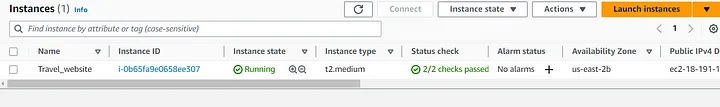
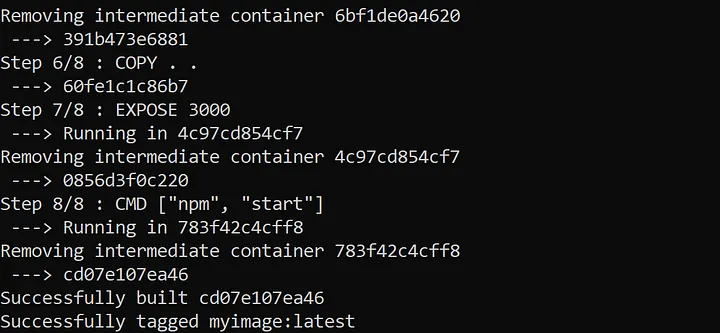

# travel-website

Dockerizing the Travel Website. 

## Step 1 — Launch an AWS T2 Medium Instance
Login to your AWS Console, and launch an AWS T2 Medium Instance. You can use an existing key or create a new key pair. Enable HTTP and HTTPS Traffic.


## Step 2 — Make a folder and clone the source code from Github onto your EC2 Instance
```
sudo apt update
sudo apt install docker.io
mkdir project1
cd project1/
git clone  https://github.com/frontendzone/travel-website.git
cd travel-website/
```

## Step 3 — Make Dockerfile
```
# Use the official Node.js image as the base image
FROM node:latest

# Set the working directory inside the container
WORKDIR /app

# Copy package.json and package-lock.json to the working directory
COPY package*.json ./

# Update the machine
RUN apt install

# Install the dependencies
RUN npm -y install

# Copy the rest of the application code to the working directory
COPY . .

# Expose a port (e.g., 3000) on which the application will listen
EXPOSE 3000

# Specify the command to run the application
CMD ["npm", "start"]
```

## Step 4 — Build the Dockerfile and make an image. Run this image to create a container. Edit the Security Group.

```
sudo docker build -t myimage .
sudo docker run -itd -p 3000:3000 myimage
```



Step 5 — After testing your application, terminate the EC2 Instance
```
<Public IP Address>:3000
```


